## Discord
### [Saturn](https://discord.gg/sWcXSfeyk5)
### [Saturn (old)](https://discord.gg/YhGuuhMGwJ)

## History
* Founding date: Aug 10th, 2022
* 6b6t founding date: May 30th, 2023
* Founded by:
  * [azedev](../Players/azedev.md)

## Accomplishments
- Ending various clans (e.g; JaponAce, Zealandia, NAC)
- Co-founding [neverdies.me client](https://neverdies.me/)
- Creating NotAClient
- Creating a megabase with 20~ members (2023)
- Hosting a pvp tournament with said base members for ranks ([2023](https://www.youtube.com/watch?v=JzsQ-lfhcNc))
- Griefed Advik on his own account in 2023 (he leaked his password)
- Extensively auth camping and using auth overseer to prevent cracked players from joining
- Discovering and developing a coord exploit involving withers and end portals in early 2025
- Participating in the Elysium grief
- Creating a botnet of 7k .Saturn cracked bots within 2 days
- Using said botnet to bot 6b6t up to a new record player count (712)
- Creation of Mossad Mod

## Bases
- Armageddon (2025)
- Saturn Original Base (self-griefed) (2023)
- Saturn Main Base (self-griefed) (2023)
- Saturn Main Stash (griefed by Fulgur) (2023)
- Lambda Base (griefed by Fulgur) (2025)
- Saturn End Base (griefed by Fulgur) (2025)
- some other shitty bases

## Notable Members
- [azedev](../Players/azedev.md) (founder)
- [Fulgur](../Players/fulgur.md) (leader)
- [Wildy](../Players/wildy.md) (leader)
- Emilsen (former owner)
- PollyNeedCrack (member)
- MORTEX8 (member)
- Maximum4923 (member)
- xpmcll (member)
- ddenial (member)
- LightKaneki (member)
- Antonum (member)

## Saturn Empire
> Saturn Empire was founded by **azedev** on the 10th of August 2022 and was deleted in September 2022, the most active members of Saturn Empire made a group chat which included, **azedev**, **Emilsen**, **Fulgur**, **Wildy**, **LightKaneki** and **ddenial**.
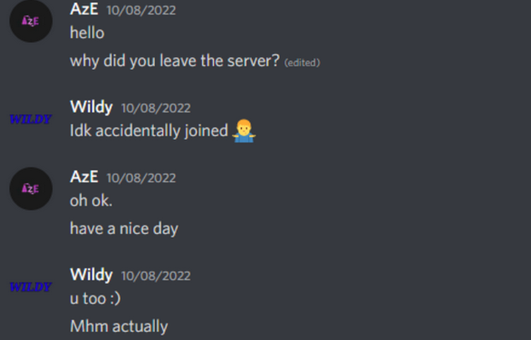

> During the time of Saturn Empire **Fulgur** joined 6b6t.org and **Wildy** started exploiting on bedrock.

> Saturn Empire had a lot of drama which included but is not limited to nuking discords.

## Saturn 6b6t
> On May 30th, 2023 **Fulgur**, **azedev** and **Wildy** made a 6b6t clan called 'Saturn 6b6t' at first only at the Saturn Original Base growing the member count to around 5~ new recruits before leaking the coordinates to the Saturn Original Base and starting construction on the bigger Saturn Main Base. To grow Saturn 6b6t's discord, adbots were made to advertise free kits if you were to join the Saturn's discord, eventually a kitbot was made by **Fulgur** to automate kit deliveries but kit deliveries were shut down after a few weeks.
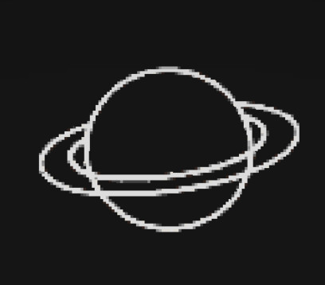

> Saturn Main Base was active and had around 20~ Saturn members with access to the base until the Saturn owners decided to self-grief all Saturn bases due to a member named goxdev attempting to use the bases to join Laggang, and the Saturn clan in it's peak had around 30~ members and a discord server with around 560 members.

> After the Saturn Main Base was griefed a purge in members was held and construction on a new base begun but remained unfinished and eventually Saturn became inactive around the start of 2024. **Wildy** gave ownership of Saturn's discord server to **bd71legend** who wanted to use the discord for his new clan 'Tesseract' but eventually lost access to the account with ownership.

Renders of the core builds at Saturn Main Base  
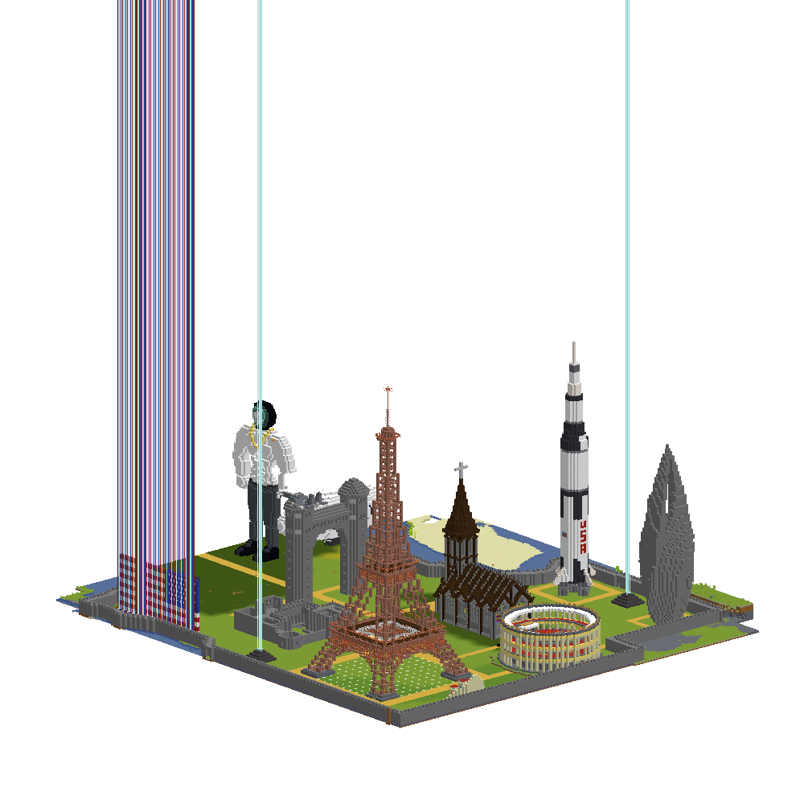
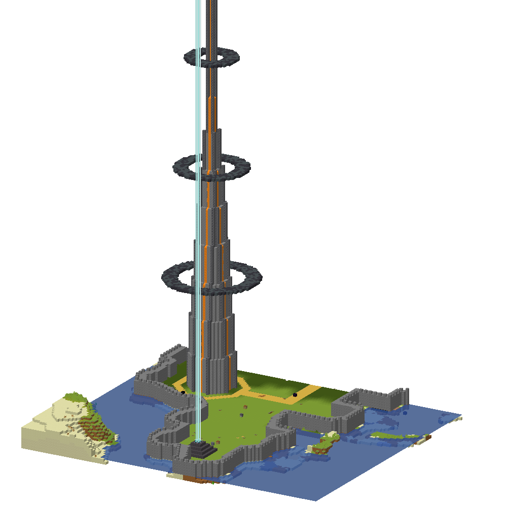

> During Saturn 6b6t, Saturn also griefed Zealandia, JaponAce and fea3ther's fight club. Auth camping was extensively used to sabotage cracked players that Saturn members didn't like. Pvp bots were also developed to attack players at spawn using normal swords during cpvp battles to wear down enemy armor.
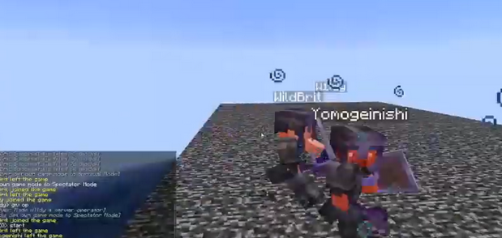

## Oxploit
> In late 2023, when Saturn was inactive the owners of Saturn made a new Anarchy Server named Oxploit that saw peak activity of 18 players before shutting down in August 2024 due to inactivity.

## Saturn 2024 revival
> Most of the time was spent working on a web/mobile app the owners were developing called 6b6tdb, this revival died after a few days.
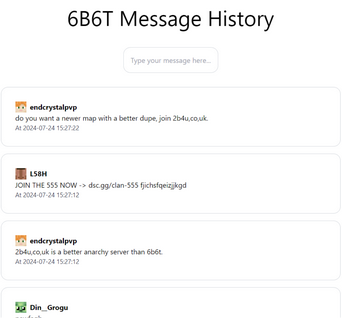

> Work was also started on an E2EE messaging system for saturn members named Velocity.
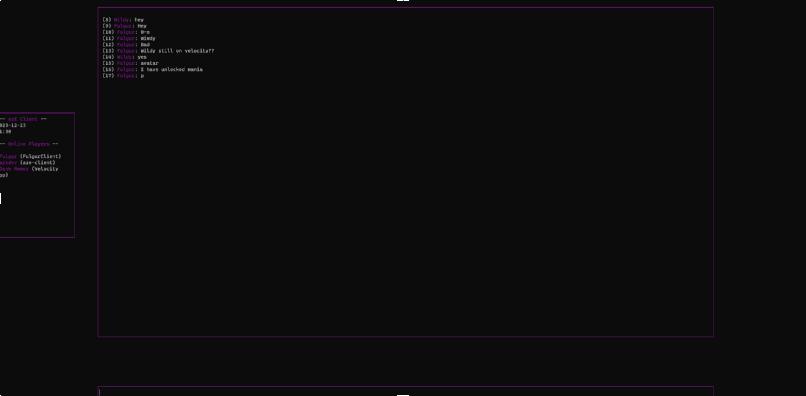

## Lambda 2025
> Lambda was a attempted revival of Saturn in february 2025 but with the additional owners **bd71legend**, **mortex** and all-members of what used to be Saturn Empire, but it died after **Fulgur** decided to grief Lambda Base and Saturn Main Stash leading the clan's discord to be deleted by **Aze** due to all of it's progress in the past few years being destroyed.
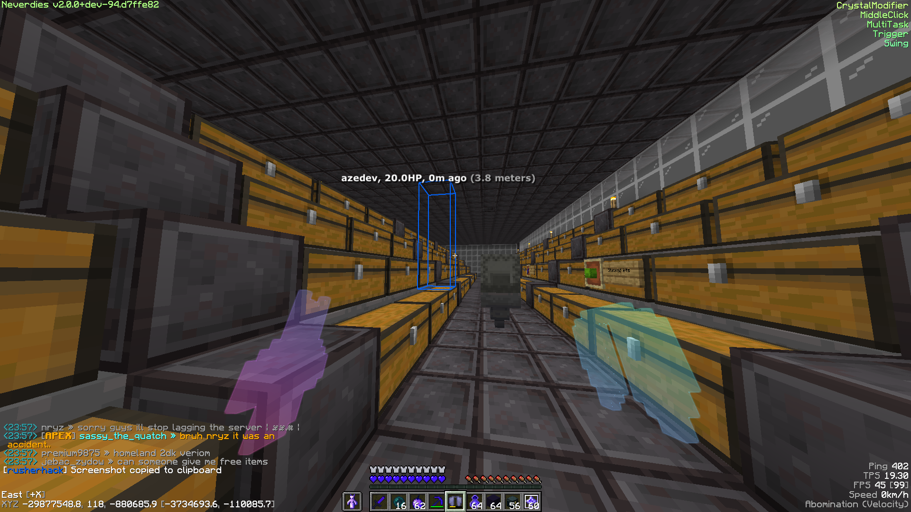

> Lambda saw the rise of various new Saturn bases and stashes aswell as the discovery of the start of the [Nautilus](https://www.youtube.com/watch?v=nJ6i9TcUgZ8) exploit (end portal/wither spawn coord exploit)

## Saturn
> Saturn members participated in the grief of [Elysium](https://www.youtube.com/watch?v=Okxs2-Em1tE) and the majority of the other Imperial bases.
> Saturn has botted the server with 500 bots in November 2025 reaching a grand total of 712 players online (a record)
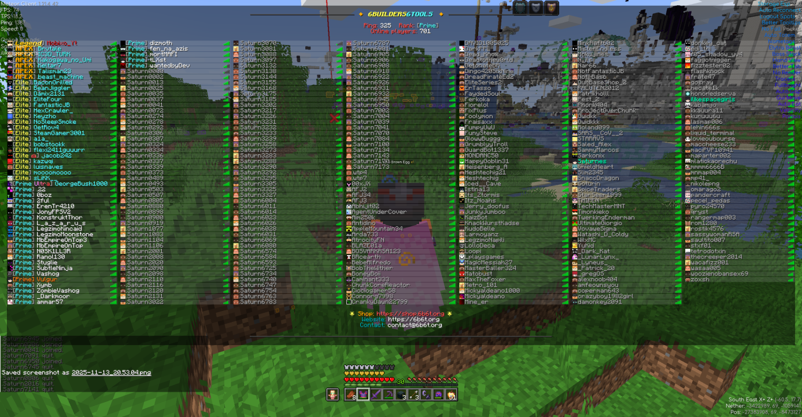

## Logo / Banner
2025 logo (made by Maximum4923)

2023 logo

## Gallery

### Screenshots
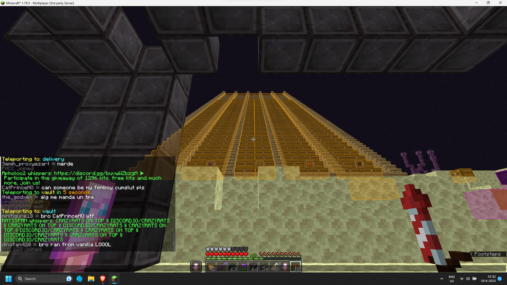
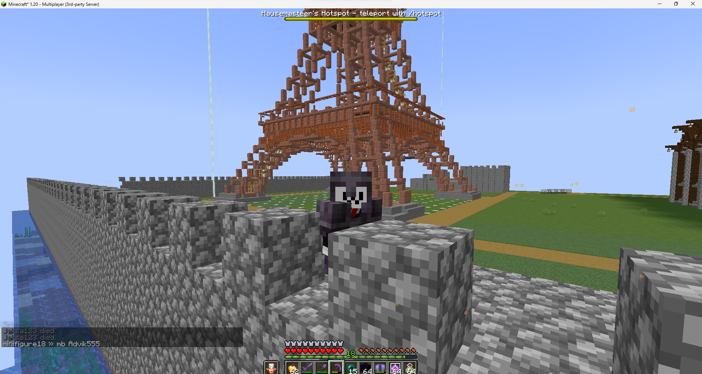

### Self griefs
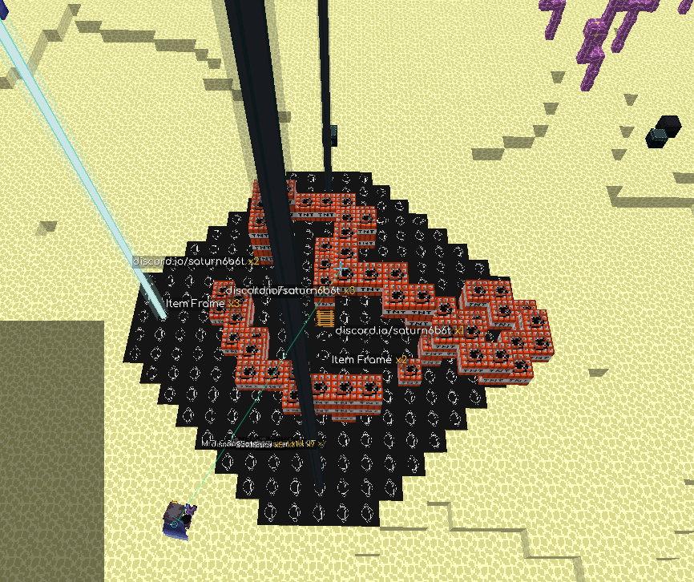
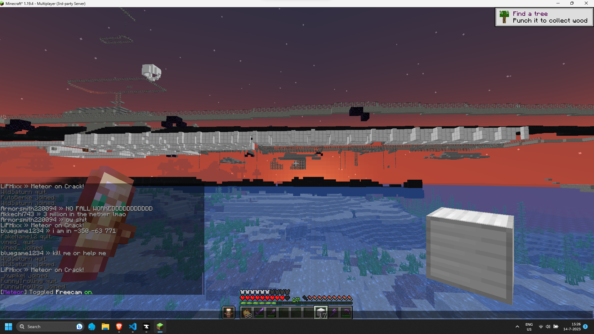
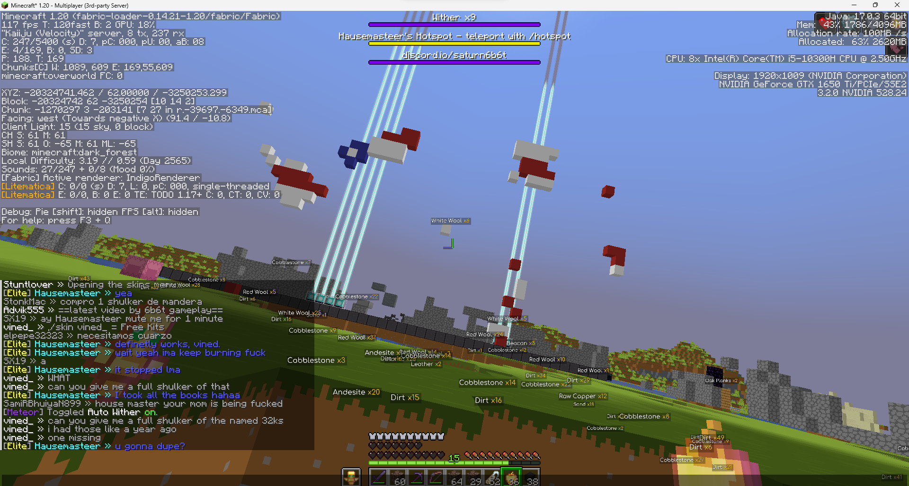
